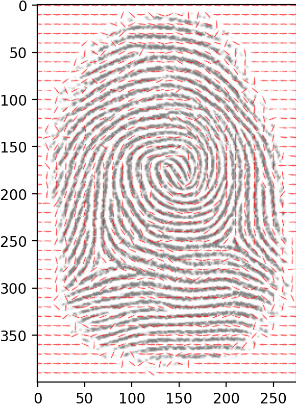

<h1> Processamento fingerprint detecção-minúcias </h1>
(EM DESENVOLVIMENTO) 
Algoritmo que detecta linhas e minúcias, tal como seus sentidos vetoriais usando principalmente filtros sobel, de gabor e outros. Futura implementação de rede neural em busca de melhor desempenho do software.

<h1>Detecção de gradiente de angulo</h1>
Ja foi feito nesta conta git <a href="https://github.com/paulo-henrique-phcm/SOBEL-deteccao-de-angulo-linhas-de-plantacao">um algoritmo teste que detectava angulos usando filtros sobel.</a>
A primeira parte da presente idéia, tal como seu algorítmo foram originados a partir daquele primeiro projeto, o qual foi modificado e melhorado para o caso em questão, portanto a parte de detecção de angulo é uma versão dele muito melhorada e com interface modificável, que permite modificar parametros importantes com velocidade para observar resultados, encontrar um bom limiar e passarmos para o próximo passo.

<h2> Interface</h2>

  No desenvolvimento dos meus códigos python costumo realizar testes alterando variáveis manualmente, rodando e observando, porém, quando o código fica grande, com funções em outros arquivos, nem adianta muito seguir paradigmas de código limpo, modificar variáveis para testes sempre vai ser trabalhoso e requerer atenção.  Pensando em melhorar isso e deixar meu próximo código mais apresentável resolvi usar o básico da biblioteca pySimpleGui.   
  A interface não foi pensada para ser interativa, mas sim para simplificar e centralizar a entrada de parametros gerais. Como é possivel observar na imagem abaixo, a tela ja vem com parametros pré-preenchidos, (o default pode ser modificado no código para agilizar) é necessário informar primeiramente o caminho da imagem a ser processada, logo depois, dados de processamentos adicionais a serem feitos na primeira fase.

<h2> Primeiros processamentos</h2>

 
  Esta fase é dividida em 3 partes mais importantes de processamento: 
    <h3>◉ Gradientes diferenciais com Sobel</h3>
      No algorítmos ja feito e citado aqui no git, está explicado o funcionamento, mas basicamente são dois filtros que detectam alterações horizontais e verticais na imagem (derivadas) retornando duas matrizes H e V.
    <h3>◉ Calculo ArcTg usando os filtros sobel</h3>
      Também explicado com masi detalhes no primeiro projeto, tendo as duas diferenciais, vertical e horizontal, podemos calcular arctg(sin/cos) para cada ponto, em que sin matematicamente é representado pela diferencial sobel H e sin é V, assim, obtemos uma matriz com valores de -π/2 á π/2 que é o range da função arctg. Este ja é o mapa gradiente com os angulos "crus" de 0º a 180º.
    <h3>◉ Calculo ABS e redução de ruído</h3>
      Um problema grande que enfrentei no código anterior foi, como plotar/trabalhar com angulos horizontais, pois, estes variam entre 180 e 0 ou π e 0, numéricamente na hora de calcular médias ou aproximações locais atrapalhava muito. Observe esta quebra na sobel arctg (segunda imagem plotada na figura abaixo)  
      Nesta versão, para resolver este problema, resolvi trabalhar com dois mapas diferentes e calcular o ABS (módulo) da matriz, o que nos retorna a imagem (abs do sobel), observe que nela ja não temos a quebra de passagem de 0 á π, mas repare que perdemos parte do range do angulo que tinhamos que antes era de 180º, agora passa a ser de somente 90º.  
      Observe que para representar uma direção vetorial só precisamos de 180º, o qual perdemos por uma boa razão. Mas ainda temos o mapa (sobels arctg). Quando o limitamos os angulos á 90º, basta imagenar que por exemplo, o angulo (135 ou 3π/4) é representado aqui por (45 ou π/4), ou seja usando o mapa sobels arctg podemos determinar se será para direita (>90º) ou para a esquerda (<90º). isso é importante para salvar os dados ou plotar.  
      O mapa estando tratado podemos aplicar algum filtro para melhorar a distribuição. até o momento foram implementados três métodos para testes.
      Se olharmos bem, o mapa possui linhas que com certeza vão interferir no angulo horiginal, caso apliquemos um filtro de média simples estes espaços que fogem muito do valor que se espera vão alterar o valor real, e foi pensando nisso que eu desenvolvi um filtro usando a opção histograma da biblioteca numpy.
      <h4>⊛ Aproximação com Histograma<h4>
  Para o histograma e para a média harmonica fiz as opções de filtro conolucional 3x3 e 5x5 manualmente. Basicamente Este filtro vai convoluir a imagem, mas para cada ponto e ao redor, ao invés de somar, é calculado um histograma, e o range com os angulos que mais aparecem é atribuido ao ponto em questão, assim, caso hajam pontos próximos, a chance deles serem considerados é muito menor e o risco de alterar o valor real por calculo de média é diminuido. 
      <h4>⊛ Aproximação com MeanHarmonic<h4>
  Como discutido, dependendo da quantidade de pontos errôneos ao redor, uma média comum pode alterar os valores reais, mesmo que antes naquele ponto o valor já fosse o correto. Para resolver isso, a média harmonica, semelhante á média comum, aproxima um valor comum, mas caso hajam valores que se repitam ou muito próximos, diz-se que estes representam o todo, por fim este método só foi implementado para testes e esta se saindo bem.
      <h4>⊛ Aproximação com blur<h4>
  Apezar de insistirmos no problema de perda de precisão, uma função com a opção blur foi implementada, pois ela será util depois, sem contar que, por mais que saibamos que problemas surgirão com seu uso nesta fase, caso façamos teste podemos constatar que uma coisa ou outra pode ser afetada positivamente e podemos tirar proveito disso.

<h2> Gradiente com setas</h2>

